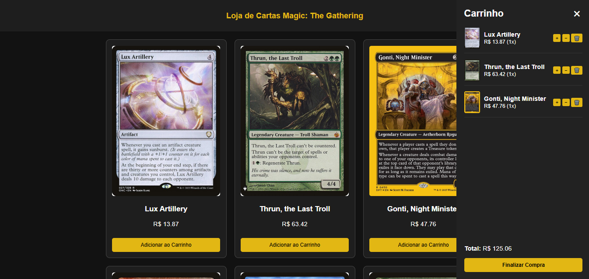
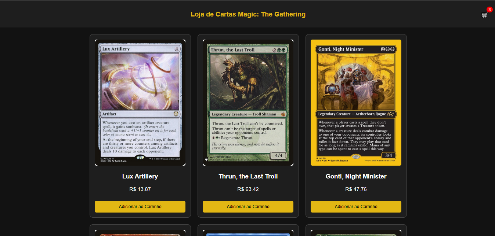
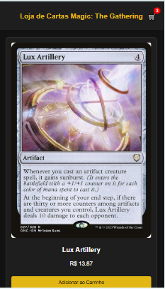
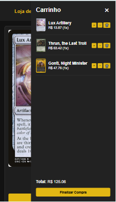

# Magic Store

Um e-commerce simples de cartas de Magic: The Gathering, utilizando HTML, CSS e JavaScript, com integração à API da [Scryfall](https://scryfall.com/docs/api).

Acesse em [MagicStore](https://ismaelsidney.github.io/magicstore/)

## 🔥 Funcionalidades

- ✅ Lista de cartas aleatórias (via API Scryfall)
- 🛒 Carrinho lateral com contador e totalizador
- 📱 Layout responsivo (1 carta por vez no mobile, até 6 no desktop)
- 🧾 Botão de checkout com popup(modal) finalizando a compra.
- ♻️ Atualização dinâmica do carrinho (incremento, remoção e esvaziar)

## 🚀 Como usar

1. Clone o repositório ou baixe os arquivos.
2. Abra o `index.html` em um navegador moderno.
3. Clique em "Adicionar ao carrinho" para adicionar cartas.
4. Clique no ícone de carrinho para visualizar.
5. Finalize a compra com o botão Finalizar compra.

## 🧪 Tecnologias

- HTML5
- CSS3 (Grid + Flexbox + Responsivo)
- JavaScript (DOM + Fetch API)
- Scryfall API

## 📷 Preview

## 📄 Licença

MIT © 2025
